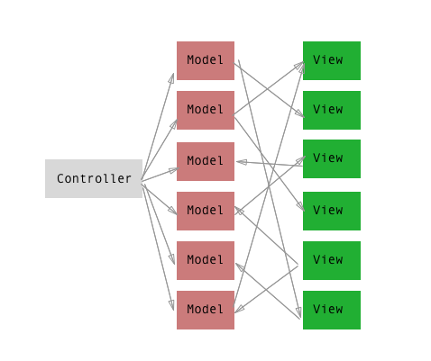

# React 101

---

# Javascript is pretty cool, but it can be cooler

???

- As developers, we don't like to wait. 


---

# Babel to the rescue! 
<https://babeljs.io/>

???

- Transpiler (transforms ES6 code to current-gen JS, and includes polyfills)
- Sourcemaps
- Available today

---

# Some useful new stuff

???

- Not going to show everything
- Just the parts that we're going to use in this session


---

### Stop using var!

    ES2015: 

```javascript
// const is single assignment
const hello = 'world';
hello = 'dude' // ERROR! CONST already declared


const obj = {};
obj.hello = 'world' // all good! 
// we're not re-assigning, just modifying the object. 
// That's why it works!

const arr = [];
arr.push('hello world') // all good!
// same thing for arrays! 


// if we need something similar to var
// we can use let
let dude = 'hey man!';
dude = 'yooooo'; // all good!
let dude = 'heyhey' // ERROR! Already declared
// but it doesn't let you redeclare it. 
// you can reassign but not redeclare.
```

???

- const and let scopes are the same as var
- const is single assignment
- let can be reassigned but declared once
- you can still use var, but you shouldn't. 


----

### Arrows and Lexical this (1/3)

Before:
```javascript
var newArr = arr.map(function(v) {
    return v + 1;
});

var newArr = arr.map(function(v, i) {
    return v + 1;
});
```

ES2015: 

```javascript
const newArr = arr.map(v => v + 1);
const newArr = arr.map((v, i) => v + 1);
```

???

- Prettier
- Easier to read
- Easier to write for simple transforms
- Note the parenthesis when there's more than 1 var

---

### Arrows and Lexical this (2/3)


Before: 
```javascript
var newArr = arr.map(function(v) {
    return this.someMethod(v);
}.bind(this)); // <--- this thing right here

or 

var self = this; // <--- this thing right here
var newArr = arr.map(function(v) {
    return self.someMethod(v);
}); 
```

After:
```javascript
const newArr = arr.map(v => this.someMethod(v));
```

???

- Uses the same "this" as its surrounding
- No need for binding or assigning to self
- Prettier
- Easier to read
- Easier to write

---

### Arrows and Lexical this (3/3)
    
    - If there's one statement, it'll return that statement
    - Only need parenthesis () if you have more than 1 var

```javascript
const newArr = arr.map((v, i) => v + 1);
```

    - Only need brackets {} if there's more than 1 statement 
    - If you use brackets, make sure there's a return

```javascript
const newArr = arr.map(v => {
    const zz = v + 123;
    return zz;
});
```

    Uses the same "this" as its surrounding

---

### Classes (1/3)

Before:

```javascript
var Animal = function(name) {
    this.name = name;
}

Animal.prototype.walk = function() {
    console.log('walk');
}

var Dog = ........

// Too complicated to show the prototypal voodoo required here, 
// but basically we need a helper function that 
// extends the Animal class
```

--- 

### Classes (2/3)

ES2015: 
```javascript
class Animal {
    constructor(name) {
        this.name = name;
    }

    walk() {
        console.log('walk');
    }
}

class Dog extends Animal {
    speak() {
        console.log('woof');
    }
}

const fido = new Dog('fido');
fido.walk() // log: walk
fido.speak() // log: woof

```

---

### Classes (3/3)

TLDR: 
    - Easy to read
    - Easy to write
    - Easy to extend
    - No need for commas between methods
    - It's not Java™ OOP but it's just what we need.

--- 

### Object Sugar

Before: 

```javascript
var obj = {
    handler: handler,
    log: log,
    hello: hello,
    omg: omg,
    someStuff: 'hello',
}
```

ES2015:
```javascript
const obj = {
    // if it's the same name, 
    // no need to repeat it! aww yisss.
    handler,   
    log,
    hello, 
    omg,
    someStuff: 'hello',
}
```

???

- This will be very useful for us in React and Redux

---

### Template Strings

Before:

```javascript
var name = "Mikey Mike";
var title = "Señor";
var output = 'Hello ' + title + ' ' + name + "\r\nGood morning" ;
// output: 
// Hello Señor Mikey Mike
// Good morning
```

ES2015: 

```javascript
const name = "Mikey Mike";
const title = "Señor";
const output = `Hello ${title} ${name}
Good Morning`;
// output: 
// Hello Señor Mikey Mike
// Good morning
```

???

- Multiline!
- String interpolation! 
- Awesome!

--- 

### Rest

Before: 
```javascript
function countNinjas(village) {
    
    return village + ' has ' + (arguments.length - 1) + ' ninjas';
}

countNinjas('Leaf', 'Naruto', 'Sasuke', 'Sakura') 
// output: Leaf has 3 ninjas
```

ES2015
```javascript
function countNinjas(village, ...ninjas) {
    
    return `${village} has ${ninjas.length} ninjas`;
}

countNinjas('Leaf', 'Naruto', 'Sasuke', 'Sakura') 
// output: Leaf has 3 ninjas
```

???

- Alone, it's pretty useless

--- 
### Destructuring (objects)

Before:
```javascript
var options = {
    method: 'GET',
    url: '/api/v1/hello',
};

var method = options.method;
var url = options.url;
... 
```

ES2015: 
```javascript
const options = {
    method: 'GET',
    url: '/api/v1/hello',
};

const { method, url } = options;
```

???

- Makes the code a lot easier to read 

--- 
### Destructuring (arrays)

Before:
```javascript
var Sayans = ['Goku', 'Gohan', 'Vegeta'];
var goku = Sayans[0];
var gohan = Sayans[1];
...
```

ES2015: 
```javascript
const Sayans = ['Goku', 'Gohan', 'Vegeta'];
const [ goku, gohan, vegeta ] = Sayans;

goku === 'Goku' // true!
```

???

- Useful for known arrays index like Promises

---
### Destructuring + Rest

ES2015
```javascript
const url = 'player.me/feed/123123';
const [domain, ...rest] = url.split('/');
console.log(domain, rest);
```

???

- This is bad code
- But it shows how you can use something like that

---

### Default params

Before: 
```javascript
function plusSomething(x, y) {
    if (typeof y === 'undefined') { // lol
        y = 12;
    }

    return x + y;
}

plusSomething(5) // answer: 17
```


ES2015:
```javascript
function plusSomething(x, y = 12) {
    return x + y
}

plusSomething(5) // answer: 17
```

???

- Can't believe this hasn't existed for 20 years

--- 

### Default + Destructuring + Rest

Before: 
```javascript
function ajax(params) {
    var defaultParams = {
        method: 'GET',
    }

    var realParams = extend({}, defaultParams, params);
    var method = realParams.method;
    var url = realParams.url;

    delete realParams.method,
    delete realParams.url;

    return _superAjaxLibrary(method, url, realParams);
}

// let's call it
ajax({
    url: 'api/v1/post', 
    params: {
        text: 'hello world'
    }
})
```

???

- Hard to read
- Most of the lines are simply to get the proper variables

--- 

### Default + Destructuring + Rest

ES2015: 
```javascript
function ajax({method = 'GET', url, ...params}) { 

    return _superAjaxLibrary(method, url, params);
}

ajax({
    url: 'api/v1/post', 
    params: {
        text: 'hello world'
    }
})
```

???

- So many less lines
- So much clearer

---

### Extending objects (Rest bonus)

Before:
```javascript
var defaultParams = {
    method: 'GET',
}

var realParams = Object.assign({}, defaultParams, params);
// or 
var realParams = jQuery.extend({}, defaultParams, params);
```

ES2015: 
```javascript
const defaultParams = {
    method: 'GET';
}

const realParams = {
    ...defaultParams,
    ...params
}
```

???

- Something that we'll often with Redux
- It creates a new object, very important

----

### Modules (1/2)

Before: 

```javascript
// file: hello.js
module.exports = function() {
    console.log('hello world');
}

// file: index.js
var hello = require('./hello');
hello();
```

ES2015:
```javascript
// file: hello.js
export default function() {
    console.log('hello world');
}

// file: index.js
import hello from './hello';
hello();
```

???

- Still not useable in the browser as is, yet
- Very useful for compiling and organising code
- Old way was to use globals or requireJS

---

### Modules (2/2)

ES2015:
```javascript
// file: hello.js
export default function() {
  console.log('hello world');
}

export function spanish() {
  console.log('hola mundo')
}


// file: index.js
import english, * as Greetings from './hello';
Greetings.spanish();

// or by using destructuring

import { spanish } from './hello';
spanish();

```

???

- This is something we'll use all the time for code organization

--- 

## And more, but we don't have time for that :(

- **promises**
- async functions and generators
- iterators
- map, set, weakmap and weakset
- proxies
- new apis for Math, number, string and Object 


???

- Promises is really cool
- Async functions and generators makes it even cooler

---

# Homework (not really, but try it)!

Install babel [babeljs.io](https://babeljs.io) and learn to use it now :-)

and/or use the REPL [babeljs.io/repl](https://babeljs.io/repl/) to see how it compiles code to 


--- 

# Q&A about Babel and ES2015
Before we continue to the fun stuff

--- 

# React 

The reason you're all crammed into this room listening to this fat guy

???

- React is a library, not a framework
- Very Simple API

---

### The DOM is one big tree. 


???

- With times, the DOM has gotten complicated
- Querying the DOM is expensive
- Writing to the DOM is expensive

--- 

# React concepts 

Describe the tree, and I'll make sure the DOM will look like it.

--- 

### How it works on high level

- Create a tree using objects (called the Virtual DOM)
- When something changes, generate a brand new tree, and compare it
- Change **only the parts that change**

Basically: the DOM is mirrored by our Virtual DOM. 

- We never update or mutate the DOM
- We simply re-render it

---

## Let's say we want to do this: 
```html
<div class="container">
    <div class="hello">
        <p>My name is Marlo and I like to eat: </p>
        <ul>
          <li>KFC</li>
          <li>Mcdonalds</li>
          <li>Burger King</li>
        </ul>
    </div>
</div>
```

--- 

## Virtual DOM representation

```javascript
{
  type: "div", props: { className: 'container' },
  children: [
    {
      type: "div", props: { className: 'hello' },
      children: [
        {
          type: "p", 
          children: [
            'My name is Marlo and I like to eat: '
          ]
        },
        {
          type: "ul",
          children: [
            {
              type: 'li',
              children: ['KFC']
            }, ...
          ]
        }
      ]
    }
  ]
}
```

???

- Simple reminder: We don't have to do this. It's just how it almost looks like behind the scenes. 

---

# React in a nutshell

---

```javascript
// first import react functions to create the tree
import { Component, createElement } from 'react';

class HelloWorldApp extends Component {

  render() {

    return createElement('div', {className: 'container'}, [
      createElement('div', {className: 'hello'}, [
        createElement('p', {}, [ 'My name is Marlo ...' ]),
        createElement('ul', {}, [
          createElement('li', {}, [ 'KFC' ]),
          createElement('li', {}, [ 'Mcdonalds' ]),
          createElement('li', {}, [ 'Burger King' ]),
        ])
      ])
    ]);

  }
}

// import the function that will render the tree
import { render } from 'react-dom';

// render the tree!
const appContainer = document.getElementById('app-container');
render(HelloWorldApp(), appContainer);

```

???

- A lot of typing 
- But it's pretty clear 

--- 

Writing createElement all the time is tedious, and it makes it hard to understand what's going on. 

```javascript
class HelloWorldApp extends Component {

  render() {

    return createElement('div', {className: 'container'}, [
      createElement('div', {className: 'hello'}, [
        createElement('p', {}, [ 'My name is Marlo ...' ]),
        createElement('ul', {}, [
          createElement('li', {}, [ 'KFC' ]),
          createElement('li', {}, [ 'Mcdonalds' ]),
          createElement('li', {}, [ 'Burger King' ]),
        ])
      ])
    ]);

  }
}
```

---

## Instead, write JSX!

```javascript
class HelloWorldApp extends Component {
  render() {

    return <div className="container">
        <div className="hello">
            <p>My name is Marlo and I like to eat: </p>
            <ul>
              <li>KFC</li>
              <li>Mcdonalds</li>
              <li>Burger King</li>
            </ul>
        </div>
    </div>
  }
    
}

const appContainer = document.getElementById('app-container');
render(<HelloWorldApp />, appContainer)
```

???

- This is real react code
- Almost a copy paste of HTML

---

# Exercice 0! 
Because I decided to add this at the last minute and didn't want to rename all the slides

--- 

# Let's use jsFiddle!

<http://jsfiddle.net/user/maktouch/fiddles/>

And just choose **Exercice #0**

---

### Solution for Exercice #0

```html
<div id="container"></div>
```

```javascript
class Hello extends Component {
  render() {
    return <div>
      Hello world!
    </div>
  }
}

render(<Hello />, document.getElementById('container'));

```

???

- This is the ultra basic.
- Kinda boring
- Let's inject props 

---

### This is how we inject props

```javascript
render(<HelloWorldApp name="Marlo" />, c)
```

Similar to HTML Props!

This is how we consume the props

```javascript
class HelloWorldApp extends Component {
  render() {
    
    return <div className="container">
        <div className="hello">
            <p>Hello, my name is {this.props.name}</p>
        </div>
    </div>
  }
}

```

---

### Props can be a lot of things (array)

```javascript
class HelloWorldApp extends Component {
  render() {
    
    const foods = this.props.foods.map(f => <li>{f}</li>);

    return <div className="container">
        <div className="hello">
            <p>My name is {this.props.name} and I like to eat: </p>
            <ul>
              {foods}
            </ul>
        </div>
    </div>
  }
}

render(<HelloWorldApp name="Marlo" foods={['KFC', 'Brownies']}/>, c)

```

---

### Props can be a lot of things (object)

```javascript
class HelloWorldApp extends Component {
  render() {
    
    return <div className="container">
        <div className="hello" style={this.props.styles}>
            <p>My name is {this.props.name}</p>
        </div>
    </div>
  }
}

render(<HelloWorldApp name="Marlo" styles={{color: 'red'}}/>, c)

// notice the {{ 
// that's because if it were a variable

const styles = { color: 'red' };
render(<HelloWorldApp name="Marlo" styles={styles}/>, c)

```

*Inline style like it's 1999 baby*

???

- inline styles is not so bad in React, but won't have time to talk about this
- we can also pass functions but we'll get there in a few slides.

---

## Some notes about JSX

- You don't have to use it, but it's silly not to. 

--

- It's **NOT HTML**. It looks like it, but it's not. 

--

- We're simply building a tree that will represent the DOM.

--

- Variables has to be wrapped around `{}`

--

- Every outputted var with {} is escaped. No XSS! 

--

- It's *very* strict. Everything must have a closing tag. 

--

- `` is invalid (no closing tag)

--

- `` is the correct way

???

- Before we step to the next exercice, 
- let's learn about the most important thing in React

---

# Reuse components!

---

```javascript
class Hello extends Component {
  render() {
    
    const foods = this.props.foods.map(f => <li>{f}</li>);

    return <div className="hello">
      <p>My name is {this.props.name} and I like to eat: </p>
      <ul>
        {foods}
      </ul>
    </div>
  }
}
```

```javascript
class HelloApp extends Component {
  render() {

    return <div className="container">
      <Hello name="Marlo" foods={['KFC']} />
      <Hello name="Orland" foods={['Mcdonalds']} />
      <Hello name="Mak" foods={['KFC', 'Mcdonalds']} />
    </div>
  }
}

```

???

- We removed container and just kept "hello"
- This makes it really reusable

--- 

# Exercice #1
Movie time!

--- 

# Let's use jsFiddle!

Because setting up Babel and JSX is very boring

<http://jsfiddle.net/user/maktouch/fiddles/>

And just choose **Exercice #1**

---

# Time up! 

Let's live code it together :-)

---

# Events
Clicking and stuff

---

### Super basic example

```javascript
class HelloApp extends Component {

  handleClick() {
    alert('single click!');
  }

  handleHover() {
    alert('hooooover');
  }

  render() {

    return <div>
      <div onClick={this.handleClick.bind(this)}>Click me!!</div>
      <div onClick={this.handleClick.bind(this)}>Click me too</div>
      <div onHover={this.handleHover.bind(this)}>Hover me!!</div>
    </div>
  }
}
```

???

- Same as vanilla JS
- .bind(this) is only necessary if you use "this", but its good practice to always put it. 
- .bind(this) is unfortunately necessary if it's declared in the component
- Synthetic event, it's not a real browser event.

---

### With constructor

```javascript
class HelloApp extends Component {

  constructor() {
    this.handleClick = this.handleClick.bind(this);
    this.handleHover = this.handleHover.bind(this);
  }

  handleClick() {
    alert('single click!');
  }

  handleHover() {
    alert('hooooover');
  }

  render() {

    return <div>
      <div onClick={this.handleClick}>Click me!!</div>
      <div onClick={this.handleClick}>Click me too</div>
      <div onHover={this.handleHover}>Hover me!!</div>
    </div>
  }
}
```

???

- In constructor so the render code is cleaner. 

---

### Passing an handler (function) as prop

```javascript
class Actor extends Component {
  render() {

    return <div>
      <span>{this.props.name}</span>
      <button onClick={this.props.onLike}>Like!</button>
    </div>
  }
}
```

```javascript
class Movie extends Component {
  
  onLike() {
    console.log('Me likey');
  }

  render() {

    return <div>
      <Actor name="Brad Pitt" onLike={this.onLike.bind(this)}/>
      <Actor name="Angelina J." onLike={this.onLike.bind(this)}/>
    </div>
  }
}
```

---

### You can even pass inline functions! 

```javascript
class Actor extends Component {
  render() {

    return <div>
      <span>{this.props.name}</span>
      <button 
        onClick={e => this.props.onLike(this.props.name)}>Like!</button>
    </div>
  }
}
```

```javascript
class Movie extends Component {
  
  onLike(name) {
    console.log(`Me likey ${name}`);
  }

  render() {

    return <div>
      <Actor name="Brad Pitt" onLike={this.onLike}/>
      <Actor name="Angelina J." onLike={this.onLike}/>
    </div>
  }
}
```

---

# Forms events and inputs
Where it gets a little tricky

---

### Uncontrolled Input

```javascript
class Movie extends Component {
  
  handleChange(e) {
    console.log(e.target.value);
  }

  render() {

    return <form>
      <input 
        type="text" 
        onChange={this.handleChange.bind(this)}/>
    </form>
  }
}
```

???

- Uncontrolled input is good for read-only fields
- For example, a login screen. 

### Controlled Input

```javascript
class Movie extends Component {
  
  handleChange(e) {
    console.log(e.target.value);
  }

  render() {

    return <div>
      <input 
        type="text" 
        value="Hello"
        onChange={this.handleChange.bind(this)}/>
    </div>
  }
}
```

???

- The value never changes
- The change gets fired but the DOM doesn't follow
- That's because Virtual DOM has priority over the DOM

---

# How do we make a real Controlled Input?

---

# With Component State!

---

```javascript
class Movie extends Component {

  constructor() {
    this.state = {
      value: ''
    }
  }
  
  handleChange(e) {
    this.setState({
      value: e.target.value,  
    });
  }

  render() {

    return <div>
      <input 
        type="text" 
        value={this.state.value}
        onChange={this.handleChange.bind(this)}/>
    </div>
  }
}
```

???

- This is the reason why we need .bind(this)
- Very important to not modify state directly

---

## Important notes about component state

- They cannot be controlled from outside the component 

--

- They cannot be modified directly using `this.state.value = 'hello'`. You HAVE to use setState

--

- Don't store computed data.

```javascript
this.state = {
  movies: [movie1, movie2, movie3],
  moviesCount: 3 // <--- this is bad!
}

// Instead, calculate the length in render function
render() {
  const moviesCount = this.movies.length;
  return <div>{moviesCount}</div>
}

```

--

- Try to keep your components stateless. State is a double edged sword. 

---

## A common pattern for states

- Keep the state in the root component 
- Pass the state as props to the childrens 
- Also pass a function that will change the state to the children

---

```javascript
class App extends Component {
  constructor() {
    this.state = { name: '' }
  }

  changeName(name) {
    this.setState({ name }); // remember, this is ES6. 
  }

  render() {
    return <div>
      <NameForm 
        name={this.state.name} 
        changeName={this.changeName.bind(this)}/>
    </div>
  }
}
```

```javascript
class NameForm extends Component {
  render() {
    return <input 
      value={this.props.name} 
      onChange={e => this.props.changeName(e.target.value)} />
  }
}

```

---

# Exercice #2! 
Submitting a blog post!

---

# Let's use jsFiddle! 

<http://jsfiddle.net/user/maktouch/fiddles/>

And just choose **Exercice #2**

---

# Component references

???

- I was debating whether to show this or not
- but it's an important part of React

---

## Sometimes, we need to physically access the element in the DOM.

Examples: 
  
- focus a form input
- calculate the width/height of an element, or get the element's position in the DOM
- attach some jQuery stuff to that specific element

---

## Basic Code example

```javascript

class Example extends Component {
  hello() {
    alert('hello!!!');
  }

  render() {
    return <div>I'm a dummy component</div>
  }
}
```


```javascript
class App extends Component {

  onClick() {
    this.refs.exampleHello.hello();
  }

  render() {
    return <div>
      <button onClick={this.onClick.bind(this)}>Click me</button>
      <Example ref="exampleHello"/>
    </div>
  }
}
```

---

# Lifecycle Hooks

???

- Important to know if you are integrating React to an existing codebase
- and want to re-use some methods or jQuery plugin
- This is what makes React very friendly with other libraries and framework

---

## What's lifecycle hooks?

- Sometimes we need to execute stuff before or after a component has "mounted"

--

- Or maybe after it's been changed

--

- For example, making a component for a jQuery plugin

-- 

- Or... set loading before it's mounted, and while it's being mounted, execute an ajax

---

## First render

- componentWillMount
  - executed just before it renders
  - you can use this.setState here! 
  - send an ajax request!

--

- render 
  - Render the components

--

- componentDidMount
  - Your component as been rendered, so it's on the DOM
  - we can use "ref" to query them (more on this later)
  - attach non-react events listener

---

## On Update

- shouldComponentUpdate
  - The only thing you have to tweak for performance in React
  - By default, return true.. so it always re-render
  - If you return false, your component will never update

--

- componentWillUpdate
  - receives `nextProps<object>`, `nextState<object>`
  - Similar to "componentWillMount", you can use to send ajax request or something

--

- render
  - Render the component

--

- componentDidUpdate
  - similar to componentDidMount
  - do some stuff to the DOM

---

## On Unmount 

- componentWillUnmount
  - executed just before it's removed from the dom
  - can be used to remove the non-react events we bound in `componentDidMount`

---

# Wrapping a jQuery plugin
An example that everyone can relate to!

---

## Slideshow Plugin

```html
<ul id="slideshow">
  <li></li>
  <li></li>
</ul>
```

```javascript
$("#slideshow").slideshow();
```

---

```javascript
import { findDOMNode } from 'react-dom';
import $ from 'jquery';

class Slideshow extends Component {
  componentDidMount() {
    $(findDOMNode(this.refs.container)).slideshow();
  }

  componentDidUpdate() {
    $(findDOMNode(this.refs.container)).slideshow('refresh');
  }

  render() {
    return <ul 
      ref="container" 
      {...this.props}>{this.props.children}</ul>
  }
}
```
--

```javascript
class App extends Component {
  render() {
    return <Slideshow>
      <li></li>
      <li></li>
    </Slideshow>
  }
}
```

---

# Exercice 3! FizzBuzz!
This one is going to be a little harder!

---

# Flux architecture

---

## MVC Can get pretty messy

